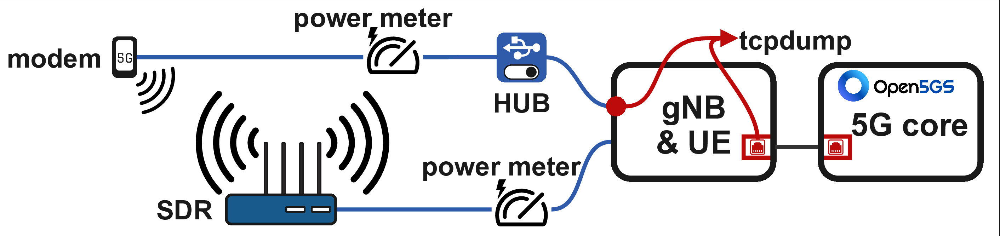
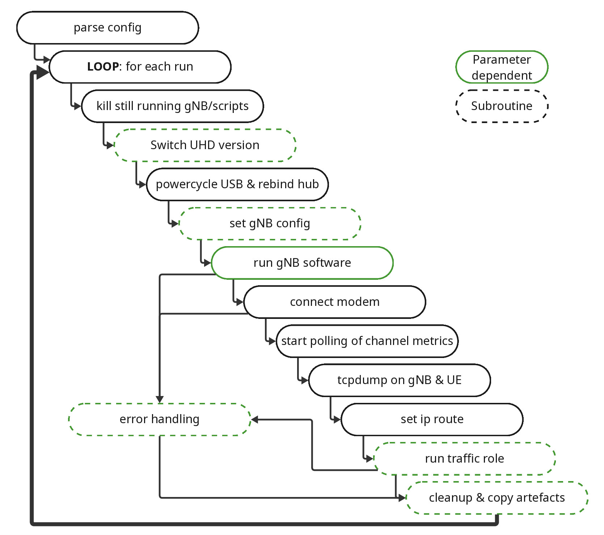
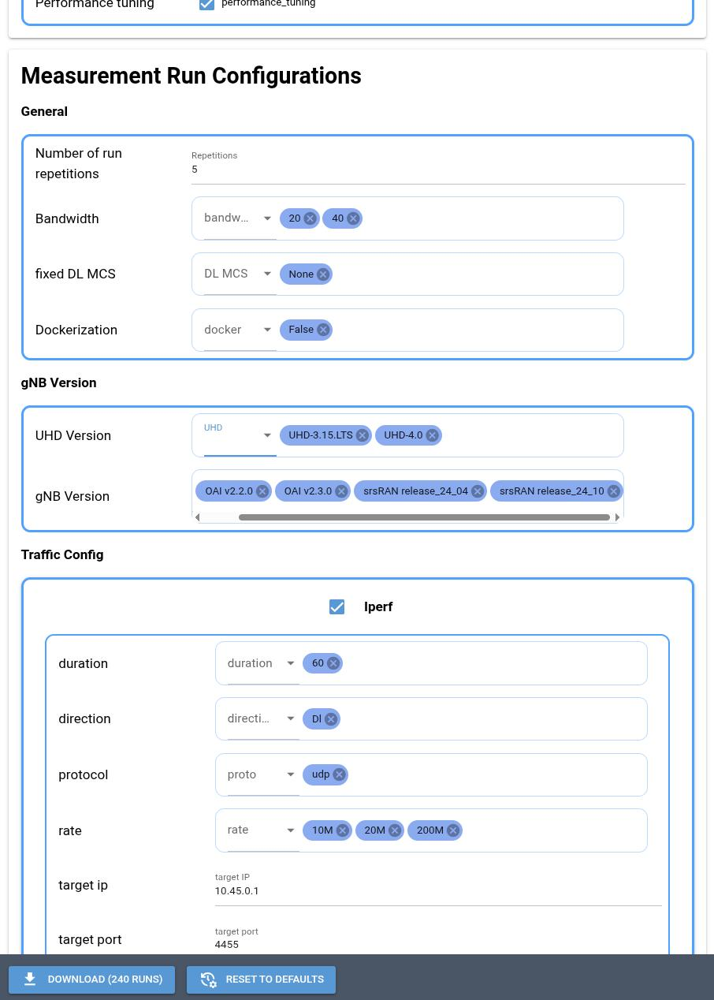

# 5G Testbed Automation Framework

This repository presents the current state of the 5G testbed automation framework of the Chair of Communication Networks of the University of Wuerzburg.

## Table of contents

* [Testbed description](#testbed-description)
  * [Hardware](#hardware)
  * [Software](#software)
* [Ansible-based Automation](#ansible-based-automation)
  * [Structure of one measurement run](#structure-of-one-measurement-run)
* [Additional Tooling](#additional-tooling)
  * [WebUI for configuration creation](#webui-for-configuration-creation)
  * [Analysis of aquired results](#analysis-of-aquired-results)

<!-- Created by https://github.com/ekalinin/github-markdown-toc -->

## Testbed description

The general setup can be seen in the diagram below. Software-defined radio and USB modem are controlled from the same machine,
allowing traffic captures without time synchronization.
Both devices use USB as there means of power delivery and both cables are equipped with TinkerForge Voltage/Current bricklets.
A USB hub between modem and host enables remote power cycling of the device.


### Hardware
This automation framework was developed and tested on the following hardware:
- USRP B210
- Modems:
  - SIMCom SIM8200EA-M2
  - Quectel RM500Q-GL
  - Quectel RM520N-GL
- USB Hub: UUGear MEGA4: 4-Port USB 3.1 PPPS Hub
- TinkerForge Voltage/Current Bricklet 2.0 for power & energy measurements

### Software
- Open5gs 2.76
- Ubuntu 22.04 on core & gNB host (compatibility to 24.04 is currently developed)
- iperf3 server on 5G core (`sudo iperf3 -s -p 4455 --bind 0.0.0.0`) for iperf3 throughput measurements
- CBR server on 5G core (`sudo ./udp-server.py -i 0.0.0.0 -p 3344 -a true`) for latency measurements with the constant bitrate generator


## Ansible-based Automation

The core of our automation approach is a collection of Ansible playbooks and roles, which can be found in `./ansible/`.
Before initial setup, in `./ansible/config/`, following settings should be configured to your specification:
- `inventory.yaml`: usernames and IP configurations for the utilized host machines
- `bandwidth.yaml`: list of used bandwidths, including the required ARFCN points for OAI and srsRAN
- `gnb-versions.yaml`: defines UHD versions and combination of srsRAN/OAI and UHD versions which this testbed should support
- `gnb_config_baseline/`: provides baseline configurations, which should specify non-changing parameters, like PLMN or AMF IP. Older srsRAN versions (e.g. 24.04) use the `srs_legacy.yml` while newer versions use `srs.yml`.
- `ansible_modules.yaml`: defines the general structure of one measurement run, as described in [this section](#structure-of-one-measurement-run)

Then the `gnb-setup-versions.yaml` playbook can be used, to compile all defined UHD/gNB versions.

Runs are conducted by using the shell script wrapper `ansible-script.sh <defined-runs.yaml>`.
The optional command line paramter `--continue` can be used to automatically read the log file and continue after failure.
The `ansible-script.sh` is a wrapper around the `measurements.yaml` playbook and extends error handling and logging.
YAML-based measurement definitions can be created by using the provided [NiceGUI-based webUI](#webui-for-configuration-creation).
One example measurement series definition is provided below.

<details>
<summary>Example YAML-configuration file</summary>

```yaml
description: ''
description_short: 5GHAT 20MHz UL
system:
  pcap_dump: /storage/data/
  identifier: '4321'
  fixed_params:
    distance_floor: 1.0
    distance_nearest_wall: 1.0
    location: B205
    distance_horizontal_in_m: 1.5
    distance_vertical_in_m: 0.0
    gnb_antenna_inclanation_in_degree: 90.0
    gnb_antenna_rotation_in_degree: 0.0
    ue_antenna_inclanation_in_degree: 90.0
    ue_antenna_rotation_in_degree: 0.0
    modem: Quectel RM520N-GL
    interface_ue: wwan0
    interface_gnb: eno1
    jammer: false
    sdr: B210
    performance_tuning: true

run_definitions:

- identifier: 4321__iperfDl_OAI_TDD10-2_Bw20__005_eecb8bf4
  run: 0
  gnb_bandwidth: '20'
  dockerization: false
  rx_gain: null
  tx_gain: null
  dl_mcs: None
  ul_mcs: None
  gnb_version:
    type: OAI
    uhd_version: UHD-4.0
    version: v2.3.0
    commit: 8bf6d5d7da8c0a8384e4022fd4872e6d3d550921
  traffic_config:
    traffic_type: iperfthroughput
    traffic_duration: 60
    count: '0'
    direction: Dl
    target_ip: 10.45.0.1
    target_port: '4455'
    proto: udp
    rate: 200M
    dist: det
    iat: '0'
    size: none
    burst: '1'
  tdd_config:
    tdd_ratio: 2
    tdd_period: 10
    tdd_dl_slots: 6
    tdd_dl_symbols: 8
    tdd_ul_slots: 3
    tdd_ul_symbols: 4

- identifier: 4321__iperfDl_OAI_TDD10-2_Bw20__005_9c1f4ff0
  run: 0
  gnb_bandwidth: '20'
  dockerization: false
  rx_gain: null
  tx_gain: null
  dl_mcs: None
  ul_mcs: None
  gnb_version:
    type: OAI
    uhd_version: UHD-4.0
    version: v2.3.0
    commit: 8bf6d5d7da8c0a8384e4022fd4872e6d3d550921
  traffic_config:
    traffic_type: iperfthroughput
    traffic_duration: 60
    count: '0'
    direction: Dl
    target_ip: 10.45.0.1
    target_port: '4455'
    proto: udp
    rate: 20M
    dist: det
    iat: '0'
    size: none
    burst: '1'
  tdd_config:
    tdd_ratio: 2
    tdd_period: 10
    tdd_dl_slots: 6
    tdd_dl_symbols: 8
    tdd_ul_slots: 3
    tdd_ul_symbols: 4
```
</details>

### Structure of one measurement run
The general procedure of one measurement run is executed by the role in `ansible/roles/measurement_main/tasks/main.yaml`,
in conjunction with the module configuration in `ansible/config/ansible_modules.yaml`.
The former executes the program flow as pictured below, while the latter allows for the flexible execution of specific roles at
predefined steps in the program flow, e.g. the power-cycling of the modem at `pre_gnb_start` or the execution of power measurement routines at `pre_traffic_start`.
See example below:
```yaml
# At each time point, a list of all modules is checked. Maybe use different lists instead? e.g.? modules__pre_cleanup
timepoints:
  - pre_cleanup
  - pre_uhd_switch
  - pre_gnb_start
  - pre_ue_connect
  - pre_traffic_start
  - post_traffic_start
  - post_traffic_end

modules:
  pre_traffic_start:
    - name: Start SDR power msm
      # Link to task in role
      role: ../roles/tinkerforge_power_meter/tasks/main.yaml
      # Artefacts are 1) copied to the ansible host (=the pc running ansible and not participating in the testbed)
      #               2) deleted from the gnodeb host
      # artefacts are collected during execution (combine lists) and handled at the end.
      # artefacts which are put inside the {{ collected_artefacts }} directory don't have to be handled since the whole
      # directory is already archived and removed at the end of each run
      # if no artefacts are used, provide an empty list: artefacts: []
      artefacts:
        - "/tmp/power_sdr.csv" # this puts the file "power_sdr.csv" in the run directory after the measurement is done
      # extra vars are provided to the role
      extra_vars:
        usb_paths:
          - 3-3.1
          - 3-3.1
        usb_hub_id: 4a3e:11c1
```



## Additional Tooling

### WebUI for configuration creation
A NiceGUI-based webUI is provided to simplify the creation of measurement series.
The related source code is located in `./nicegui-frontend/`.
In the UI, a combination of parameters can be selected and the resulting measurement definition,
based on the cartesian product of all selected parameters can be downloaded.



### Analysis of aquired results
The following tools can be used to process the acquired data. In all cases, `<measurement-path>` is the path from the YAML measurement definition and optional cli parameter or environment variables can be set to stop reprocessing of already processed runs.
1. `analysis/parse-pcap.py [--skip] <measurement-path>` parses the pcaps and drops all unimportant information. CSVs are created for each pcap.
1. `[SKIP_EXISTING=true] analysis/parse-gnblog.sh <measurement-path>` parses the gNB logs and extracts SNR,MCS and other channel metrics.
1. `analysis/parse-csvs.py [--skip] <measurement-path>` parses the CSVs and aggreagtes delay and throughput on a per-run basis. Provides an aggregated `.csv.gz`/`.parquet` in the measurement path.

This process can also be automated, by usding the provided `analysis/evaluate_all.sh [--skip-existing] <measurement-path>`


[comment]: <> (## OAI)
[comment]: <> (2.4 91e7030c)
[comment]: <> (2.3 8bf6d5d7    2025.06.04)
[comment]: <> (2.2 68191088    2024.11.22)

[comment]: <> (699afafc 2025.02.27   min/max dl/ul mcs support added)

[comment]: <> (TODOS)
[comment]: <> ( core pinning)
[comment]: <> ( describe spectrum analyzer)
[comment]: <> ( autostart of iperf & udp server)
[comment]: <> ( warning if min/max mcs is not supported because of the gnb version)


