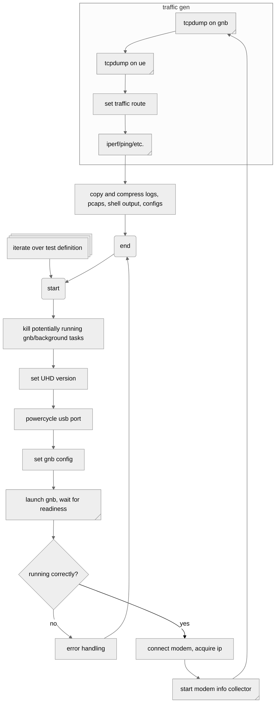

# Programm flow

```mermaid
---
config:
  theme: neutral
  layout: fixed
---
flowchart TD
 subgraph s1["traffic gen"]
        n14["tcpdump on gnb"]
        n15["tcpdump on ue"]
        n16["set traffic route"]
        n17["iperf/ping/etc."]
  end
    n3["kill potentially running gnb/background tasks"] --> n4["set UHD version"]
    n4 --> n5["powercycle usb port"]
    n5 --> n6["set gnb config"]
    n6 --> n7["launch gnb, wait for readiness"]
    n7 --> n8["running correctly?"]
    n8 -- no --> n9["error handling"]
    n8 -- yes --> n10["connect modem, acquire ip"]
    n10 --> n13["start modem info collector"]
    n13 --> n14
    n14 --> n15
    n15 --> n16
    n16 --> n17
    n17 --> n18["copy and compress logs, pcaps, shell output, configs"]
    n18 --> n19["end"]
    n2["iterate over test definition"] --> n20["start"]
    n20 --> n3
    n19 --> n20
    n9 --> n19
    n14@{ shape: tag-proc}
    n15@{ shape: tag-proc}
    n17@{ shape: tag-proc}
    n3@{ shape: proc}
    n4@{ shape: proc}
    n7@{ shape: tag-proc}
    n8@{ shape: decision}
    n13@{ shape: tag-proc}
    n19@{ shape: event}
    n2@{ shape: procs}
    n20@{ shape: event}
    linkStyle 6 stroke:#000000,fill:none
```
